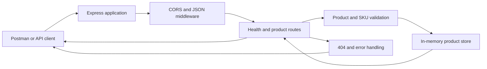

# Architecture

This project follows a small Express.js layered design intended for a learning/demo API. The architecture keeps the application simple, easy to test, and easy to reason about as a single service.

## Module responsibilities

### Application entry

The server starts in `server.js` and loads the Express app from `src/app.js`. It initializes environment variables from `.env` when present and starts listening on the configured port.

### Route layer

Routes are defined in the `src/routes` and related modules. They handle HTTP methods, validate request parameters, call the service logic, and return responses in the contract expected by the client.

### Validation layer

Validation checks ensure that incoming data meets the documented constraints before any update occurs. This includes field presence, type checks, numeric bounds, date validity, and duplicate SKU enforcement.

### Data layer

The product store is intentionally in-memory. It is lightweight and fast for a demo, but it is not durable. The data layer exposes operations for listing, creating, updating, deleting, and querying products.

### Error handling

A shared error handler normalizes failures into consistent JSON responses. It ensures that invalid requests, missing resources, malformed JSON, and unexpected server errors all return a predictable shape.

## Request lifecycle

A typical request follows this path:

1. A client sends an HTTP request to the Express app.
2. Middleware processes CORS and JSON parsing.
3. The matching route handler receives the request.
4. Validation checks run for required fields and business rules.
5. The store performs the requested operation.
6. The route returns an HTTP status code and JSON payload.
7. Any exception is caught by the global error handler and returned as a normalized JSON error.

## Design decisions

- Single-process service: suitable for demo and classroom use.
- In-memory data: keeps setup simple and avoids database dependency.
- Centralized validation: consistent rules across create and update flows.
- Shared error responses: predictable API behavior for clients and tests.
- Minimal dependencies: easier onboarding and simpler maintenance.

## Trade-offs

The current design is intentionally limited to match the Phase 1 goal. It does not include persistence, user management, or multi-instance coordination. This keeps the implementation focused on the core retail inventory workflow and the learning objectives of the project.
