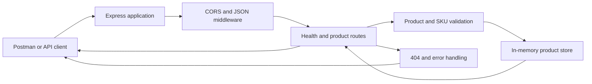

# Architecture

```mermaid
flowchart LR
    Client[Postman or API client] --> Express[Express application]
    Express --> Middleware[CORS and JSON middleware]
    Middleware --> Routes[Health and product routes]
    Routes --> Validation[Product and SKU validation]
    Validation --> Store[In-memory product store]
    Routes --> Errors[404 and error handling]
    Errors --> Client
    Store --> Routes
    Routes --> Client
```
